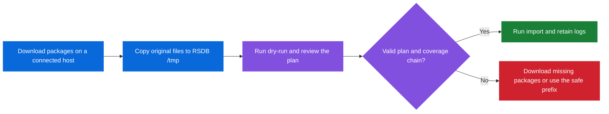

<div align="center">

<h1>FortiEDR RSDB Reputation Dump Importer</h1>

<p>Guarded imports for air-gapped and offline RSDB servers</p>

<p>
  
  
  
</p>

<p><a href="README.md">中文</a> · <a href="#quick-start">Quick Start</a> · <a href="#logs-and-state">Logs and State</a></p>

</div>

This project provides a guarded shell-based workflow for importing FortiEDR Reputation DB dump packages into an air-gapped or offline RSDB server. Download the packages from a connected environment, then copy the original files directly into `/tmp` on the RSDB server.

> [!CAUTION]
> This is an operational helper, not an official Fortinet product component. Validate it on a test RSDB before using it in production.

## Highlights

| Capability | What it does |
| --- | --- |
| 📦 Package planning | Discovers full, week, and day packages and orders them safely. |
| 🧭 Chain protection | Detects gaps, backfills, and missing parts before invoking the product CLI. |
| 🛡️ Coverage protection | Uses RSDB metadata and local state to avoid unnecessary repeat imports. |
| 🧾 Audit trail | Creates per-package product logs and persistent handled-file state. |
| 💡 Empty-directory guidance | Recommends a low-overlap download chain when `/tmp` has no valid package. |

## Included Files

| File | Purpose |
| --- | --- |
| `rsdb_import_reputation_dumps.sh` | Normal guarded importer for RSDB reputation dump packages. |

## Requirements

- Run as `root` on the RSDB server.
- The `reputationdb` CLI must be installed and usable.
- Standard Linux tools are required: `bash`, `find`, `sort`, `stat`, `flock`,
  `mount`, `findmnt`, and `df`.
- Dump packages must be stored directly in `/tmp` and retain the published
  filename format:

  ```text
  reputation-full-YYYY-MM-DD-part_part_N.zip
  reputation-week-YYYY-MM-DD-part_part_N.zip
  reputation-day-YYYY-MM-DD-part_part_N.zip
  ```

- For a new or empty RSDB, place exactly one complete full-dump date in `/tmp`
  before adding incremental packages. Do not mix historical full snapshots into
  the bootstrap directory.

- The script uses `/tmp/rsdb_ramwork` as a `tmpfs` working directory. It
  mounts it automatically when needed and requires enough RAM-backed space for
  the active package plus 1 GiB.

  This is an archive-size guard, not a prediction of product decompression or
  RocksDB growth. Size RAM and disk capacity for the full dump according to
  the FortiEDR version and the largest package you intend to import.

## Quick Start



1. Copy the main script to the RSDB server, then run a dry-run before any import:

   ```bash
   chmod 700 /tmp/rsdb_import_reputation_dumps.sh
   /tmp/rsdb_import_reputation_dumps.sh --dry-run
   ```

2. When the plan is correct, run the normal importer and retain one combined terminal log:

   ```bash
   set -o pipefail
   /tmp/rsdb_import_reputation_dumps.sh 2>&1 | tee "/var/log/reputationdb/import_runner/import_$(date '+%Y%m%d_%H%M%S').log"
   ```

> [!TIP]
> Do not call `reputationdb load-dump` directly for normal operations. The importer adds ordering, coverage, logging, and state safeguards that the raw CLI does not provide.

## Import Behavior

### Package discovery and order

- Discovers matching full, week, and day packages in `/tmp`.
- Imports full packages first.
- Sorts later week and day packages chronologically; week packages are placed
  before day packages with the same date.
- Imports parts of the same package in ascending part number order.
- Refuses incomplete part sequences unless the missing part is already known
  to be handled.
- When RSDB has no readable metadata cursor, requires exactly one full-dump
  date and an empty importer state file. It never treats state records alone
  as proof that a fresh or unreadable database is ready for weekly or daily
  updates.
- If no matching package is present, prints a download recommendation based on
  the current DB cursor and current UTC date: week checkpoints for complete
  seven-day intervals, followed by a non-overlapping daily tail. The script
  does not query the Fortinet package portal, so availability still needs to
  be checked before downloading.
- Lists ZIP files with nonconforming names when no valid package is found;
  restore the original published name before retrying.
- Does not assume that a later week package covers an earlier daily gap until
  RSDB has actually returned that package's metadata. In that situation it
  keeps the conservative gap stop or safe-prefix choice.

### Duplicate and coverage handling

- Skips a package already recorded with the same filename and size in
  `/var/lib/reputationdb/import_state/imported_dumps.tsv`.
- Reads `reputationdb last-dump-metadata` before planning and after each
  successful package import.
- Uses an actual weekly metadata `from/to` range to skip covered daily
  packages. Such skips are saved as `metadata_coverage` state records so a
  later run does not reload the same file after the metadata cursor advances.
- Does not treat a newer metadata date alone as proof that every earlier file
  was loaded.
- Treats a same-name package with a different size as a new candidate and lets
  product validation decide it.

### Continuous update-chain protection

Before importing, the script validates that the available incremental packages
form a usable continuation from the current RSDB metadata cursor. It detects:

- a missing interval before a week or day package;
- a late/backfill package that falls before the preceding cursor; and
- missing package parts.

No package is imported and no aged package is deleted when this preflight
stops the run.

For an interactive normal run, a detected gap offers a choice to import only
the verified continuous prefix or exit and download the missing packages. The
behavior can also be selected explicitly:

```bash
# Stop if any coverage gap exists.
/tmp/rsdb_import_reputation_dumps.sh --on-coverage-gap abort

# Import only the verified prefix before the first gap.
/tmp/rsdb_import_reputation_dumps.sh --on-coverage-gap import-prefix

# Preview the verified prefix without importing it.
/tmp/rsdb_import_reputation_dumps.sh --dry-run --on-coverage-gap import-prefix
```

### Plan statuses

| Status | Meaning |
| --- | --- |
| `SKIP` | The file is already handled by matching state or current verified metadata. |
| `IMPORT` | The file is eligible for `reputationdb load-dump`. |
| `CHECK` | A same-date week package is scheduled first. The day package will be evaluated after RSDB returns the week package's actual metadata range. |

`CHECK` is intentionally not a guaranteed skip or import. The decision is made
from the database metadata produced by the preceding week import.

### Resource, concurrency, and cleanup safeguards

- Refuses to start while another `reputationdb load-dump` process is active.
- Uses a lock file to prevent concurrent importer instances.
- Checks root, RocksDB, and `tmpfs` free space before imports.
- Captures each raw product invocation in a separate log file.
- Removes only handled dump files older than 15 days, after the planned import
  work completes. Dry-run reports potential cleanup without deleting files.
- Removes temporary `data_reputation-*` working files when safe to do so.

## Options

```text
--dry-run
    Print the plan and validation result without calling load-dump or deleting
    aged packages.

--type all|full|week|day
    Restrict discovery to one package type. Use only when the required earlier
    chain is already present in RSDB.

--on-coverage-gap abort|prompt|import-prefix
    Select the response to a detected incremental coverage gap. The default is
    prompt for an interactive normal run.
```

## Logs and State

| Location | Contents |
| --- | --- |
| `/var/log/reputationdb/import_runner/` | Per-package command output and optional combined `tee` logs. |
| `/var/lib/reputationdb/import_state/imported_dumps.tsv` | Filename-and-size state records for successful imports and metadata-covered daily packages. |
| `/tmp/rsdb_ramwork/` | Temporary RAM-backed working data during an active import. |

Useful status commands:

```bash
ps -eo pid,etime,pcpu,pmem,args | grep 'reputationdb load-dump' | grep -v grep || true
tail -f /var/log/reputationdb/import_runner/*.log
reputationdb last-dump-metadata
```

The importer requires both a successful command result and the product success
marker in its per-package output. It also identifies the product message
`db is missing update to use this dump` and stops with recovery guidance.

If RocksDB is rebuilt, cleared, rolled back, or restored from backup, review
and normally clear `imported_dumps.tsv` before using the importer again. A
state record is valid only for the database instance that created it.

## License

This project is released under the [MIT License](LICENSE). You may use,
modify, and redistribute it under that license. Validate compatibility with
your FortiEDR version and operational policy before use.
